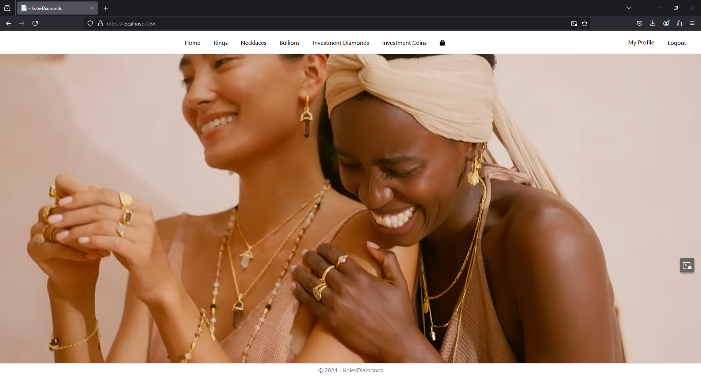
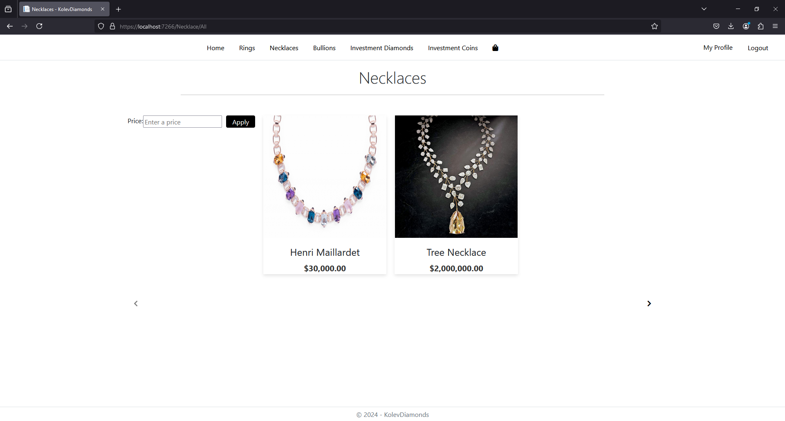
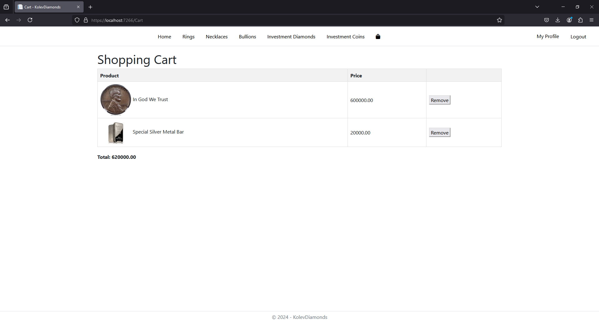
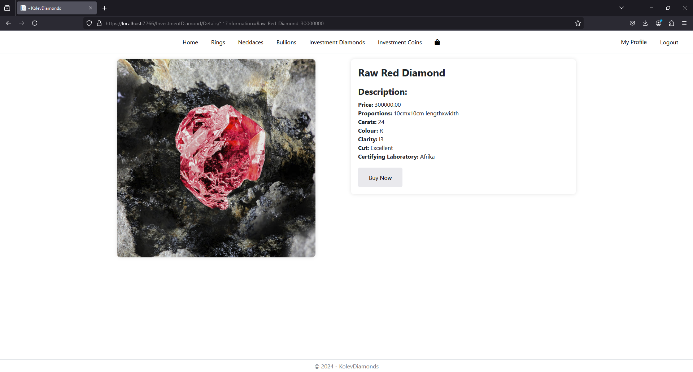

# KolevDiamonds

KolevDiamonds is an online shop offering a variety of accessories, including investment diamonds, rings, necklaces, and more. The application features a video background on the home page, a price-based search functionality, and a shopping cart.

---

## Table of Contents

1. [Overview](#overview)
2. [Features](#features)
3. [Screenshots](#screenshots)
4. [Setup Instructions](#setup-instructions)
5. [Usage](#usage)

---

## Overview

KolevDiamonds provides a seamless online shopping experience with features that make it easy for users to browse, search, and purchase high-quality accessories. 

---

## Features

- **Home Page**: A visually engaging landing page with a video background.
- **Search by Price**: Filter products based on price ranges.
- **Shopping Cart**: Add and manage items before purchase.

---

## Screenshots

1. **Home Page**: 



2. **Product Search**:

 

3. **Shopping Cart**: 



4. **Item Preview**:

 

---

## Setup Instructions

### Prerequisites

- Visual Studio (2019 or later recommended)

### Steps

1. **Clone the repository**:
   ```bash
   git clone https://github.com/100QNKolev/KolevDiamonds.git

2. Open the solution file: Open the project in Visual Studio by double-clicking the .sln file.

3. Restore NuGet packages: Visual Studio will automatically restore the required NuGet packages when the solution is loaded.
    - If you want to be sure, you can run:

    ```bash
    dotnet restore
    ```

4. Run the application:

    - Set the appropriate project as the startup project.
    - Press F5 or click on the Run button to start the application.